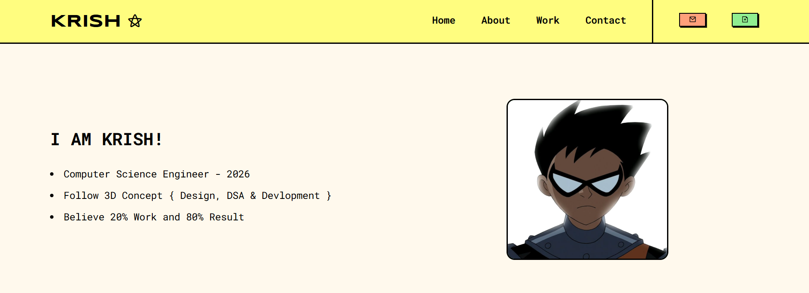
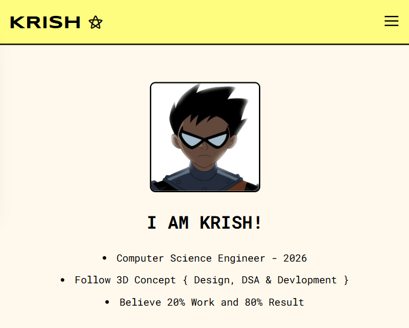

# Portfolio Basic Website

A simple portfolio website to showcase your work, skills, and projects.

## 🚀 Features
- **Home Page:** Introduction with a brief about yourself.
- **Projects Section:** Display your latest projects with images and links.
- **Contact Section:** Include your contact details and social media links.
- **Responsive Design:** Works on desktop, tablet, and mobile.

## 📂 Folder Structure
```
Portfolio-Basic-Website/
│── css/                 # Stylesheets
│   ├── app.css          # Main CSS file
│── images/              # Images and assets
│── js/                  # JavaScript files
│   ├── app.js           # Main JavaScript file
│── index.html           # Main HTML file
│── .vscode/settings.json # VS Code settings
```

## 🛠️ Technologies Used
- **HTML** - Structure of the webpage.
- **CSS** - Styling and layout.
- **JavaScript** - Interactive elements.

## 📌 Installation
1. Clone the repository:
   ```bash
   git clone https://github.com/addresskrish/Portfolio-Basic-Website.git
   ```
2. Navigate to the project folder:
   ```bash
   cd Portfolio-Basic-Website
   ```
3. Open `index.html` in a browser to view the portfolio.

## 📱 Demo
### 💻 Laptop View


### 📱 Mobile View


## 🔗 Live Demo
Check out the live version of the portfolio here:
[Live Demo](https://addresskrish.github.io/Portfolio-Basic-Website/)

## 📧 Contact
For any inquiries, reach out via:
- **GitHub:** [addresskrish](https://github.com/addresskrish)
- **Email:** addresskrish@gmail.com

---
⭐ Don't forget to **star** the repo if you like it! 🚀

